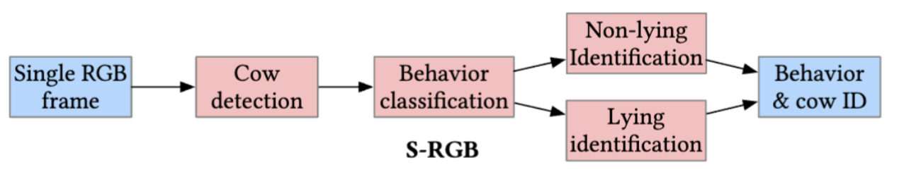

# Computer Vision-based cow monitoring




Cow Detection
------

Training:
```
python cow_detection/train_yolov8.py --data_directory /path/to/dataset/ --epochs 20 --batch_size 16
```

Testing:
```
python cow_detection/test_yolov8.py --data_directory /path/to/dataset/
```


Behavior Classification
------
Training:
```
python behavior_classifier/train.py --normalization_values_file_path  norm_params.json --model_save_path saved_models --data_path path_to_data_directory/fold_1 --fold fold_1
```

Testing
```
python behavior_classifier/test.py --test_data_path path_to_test_data/fold_1/test --normalization_values_file_path norm_params.json --fold fold_1 --model_path saved_models/best_model_fold_1.pt 
```

Standing Cow Identification
------
Training:
```
python standing_cow_identifier/train.py --normalization_values_file_path norm_params.json --model_save_path saved_models --data_path path_to_data_directory/fold_1 --fold fold_1
```

Testing
```
python standing_cow_identifier/test.py --test_data_path path_to_test_data/fold_1/test --normalization_values_file_path norm_params.json --fold fold_1 --model_path saved_models/best_model_fold_1.pt 
```

Lying Cow Identification
------
Training:
```
python lying_cow_identifier/train.py --normalization_values_file_path norm_params.json --model_save_path saved_models --data_path path_to_data_directory/fold_1 --fold fold_1
```

Testing
```
python lying_cow_identifier/test.py --test_data_path path_to_test_data/fold_1/test --normalization_values_file_path norm_params.json --fold fold_1 --model_path saved_models/best_model_fold_1.pt 
```

Overall Inference Pipeline
------
Code adapted from https://github.com/ultralytics/ultralytics.
1. Enter the configurations in ./custom_ultralytics_yolov8/inference_config.json
2. Run the following command
```
python pipeline.py --data_path data_directory/fold_1/test/images
```
